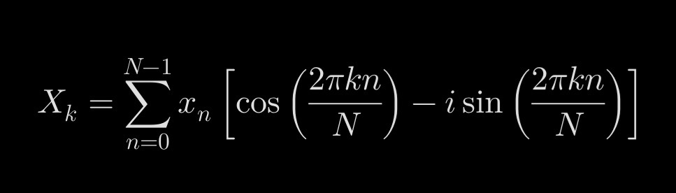
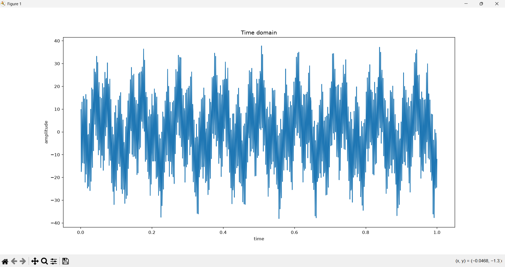
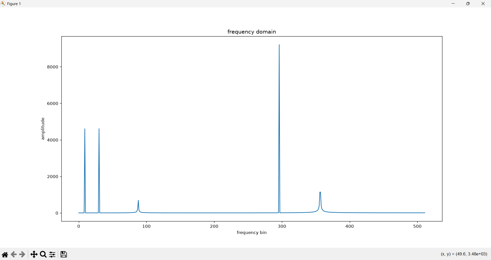

**Interactive DFT & Signal Visualizer**

A desktop application built to visualize generated signals and analyze them using the Discrete Fourier Transform

*Features:*

 • Multi Instance Signal Generation by Adding and layering multiple individual sine wave components to create a complex, composite signal.
 
 • Dynamic Parameter Control by Finetuning individual wave components using dedicated controls such as
 Time Phase Shift, Frequency, Amplitude.
 
 • Dual Domain Visualization:
 
   Time Domain Graph: Plots the aggregated composite signal over time.
   
   Frequency Domain Graph: Runs the DFT algorithm to uncover the hidden individual frequencies and their respective strengths.

  

**DFT equation**

*where*

 Xk (Frequency Domain Output): The complex coefficient representing the signal's amplitude and phase at the specific frequency bin k.
 
 Xn (Time Domain Input): The discrete sample value of your signal at time index n
 
 N (Total Samples): The total number of samples collected in the data buffer
 
 n (Time Index): The current sample number in the time domain, ranging from 0 to N-1
 
 k (Frequency Bin Index): The target frequency component you are evaluating, ranging from 0 to N-1

 **Time domain analysis**
 

**Frequency domain analysis**

 
